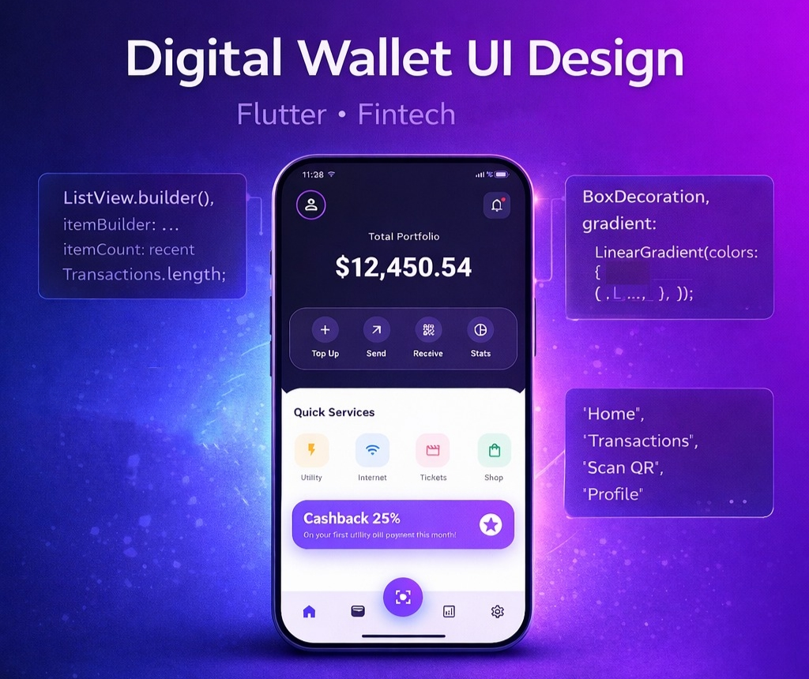

# 💳 Digital Wallet UI – Flutter

A modern Digital Wallet Dashboard UI built with Flutter, featuring glassmorphism, gradient effects, and a clean fintech wallet design.

# ✨ Features
💳 Modern Fintech Dashboard Design

🪞 Glassmorphism Action Card

🌈 Gradient Header & Promo Banner

💰 Portfolio Balance Section

⚡ Quick Services Grid

🎁 Cashback Promotion Card

🟢 Neon Floating Action Button

📱 Custom Bottom Navigation Bar

📐 Clean & Responsive Layout

🎨 UI Highlights

# Color Palette

Primary: Midnight Blue

Accent: Electric Indigo

Secondary: Soft Violet

# Design Concepts

Glassmorphism

Gradient UI

Modern Fintech Layout

Soft Shadows & Blur Effects

# 🛠️ Built With

Flutter

Dart

Material UI

BackdropFilter (for glass effect)

Custom widgets

# 📂 Project Structure

lib/
 └── wallet.dart

# 📱 Screens

Dashboard Screen

# 🚀 Getting Started

To run this project locally:

# Navigate to project folder
cd digital-wallet-ui

# Get dependencies
flutter pub get

# Run the app
flutter run
